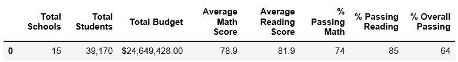
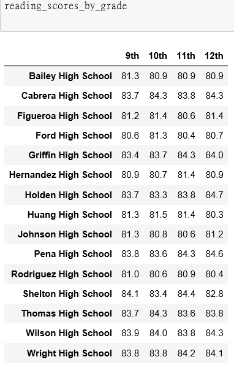

# School District Analysis
## Overview of the school district analysis:
Academic hishonesty was found; specifically, reading and math grades for Thomas High School ninth graders appear to have been altered. As a result, school board requested to void both of the math and reading scores for 9th grader from Thomas High School. In addition, school board would like to know how this change would afeect the overall analysis. The overall analysis is comparing the relationship between students' scores and various factors including different schools, school types and budgets.

## Result:

- *How is the district summary affected?* \
The district summary is mininally affected by 1% on the passing math percentage, passing reading percentage and overall passing percentage.

- *How is the school summary affected?* \
The overall passing percentage of Thomas High School decreased 26%, passing reading percentage decreased 28%, and passing math percentage decreased 26%.

- *How does replacing the ninth graders’ math and reading scores affect Thomas High School’s performance relative to the other schools?* \
Thomas High School's performance dropped significantly.

#### How does replacing the ninth-grade scores affect the following: 
- *Math and reading scores by grade:* \
Thomas High School 9th graders' math and reading scores were voided. 

- *Scores by school spending:* \
The spending rnages per student of $630-644 was affected since Thomas High School is within this range;  passing math percentage dropped by 6%, passing reading percentage and overall passing percentage both dropped by 7%.

- *Scores by school size:* \
Only the scores from Medium bin was affected since Thomas High School is included in this bin; passing math, passing reading and overall passing percentage all dropped by 6%

- *Scores by school type:* \
Both of the passing math  and passing reading percentage dropped by 4% while the overall passing percentage dropped by 3% for Chartered school since Thomas High School is part of this type. 

## Summary: 

To summarize, there are 4 majot changes in the updated school district analysis after reading and math scores for the ninth grade at Thomas High School have been replaced with NaNs. \
Thomas High School 9th graders' math and reading scores were voided when you only compare the Math and reading scores by grade. Since the 9th graders' reading and math scores were voided, those students were not counted toward students who passed math and reading. As a result, the math passing percentage, passing reading percentage and over passing percentage dropped significantly.

